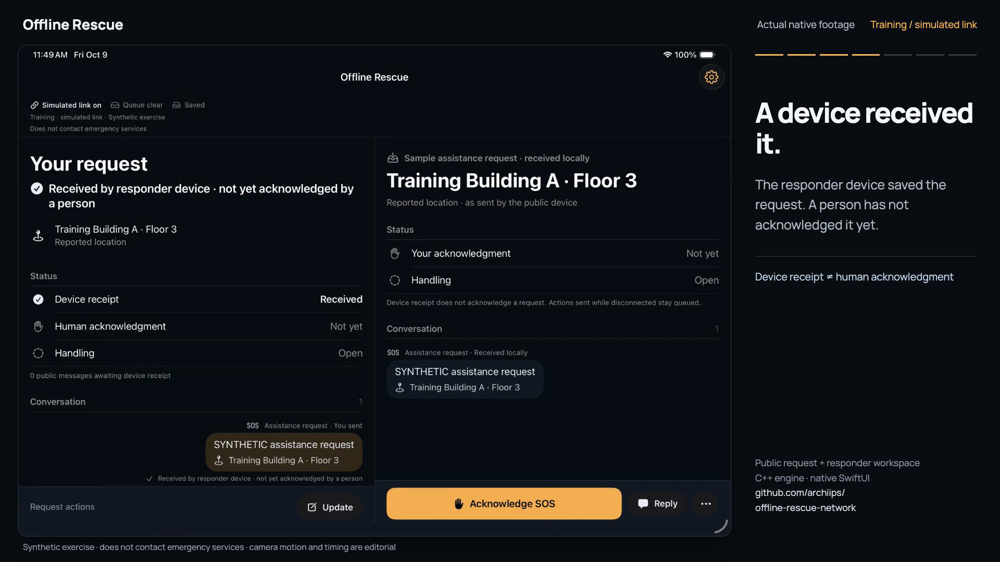
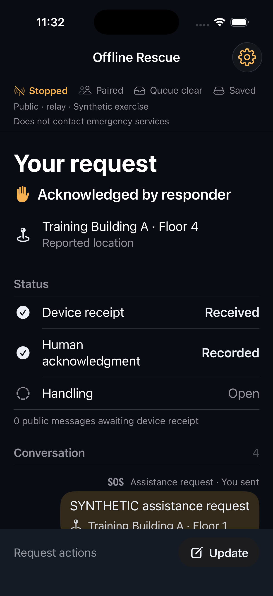
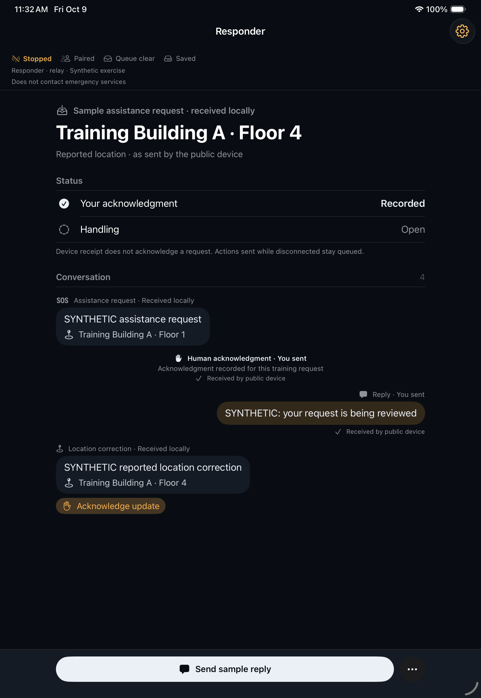
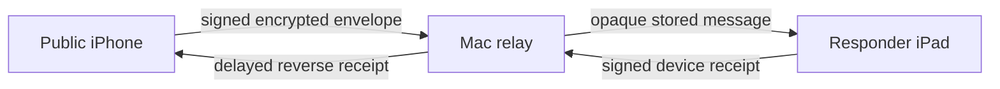

# Offline rescue network

A person asks for help. A responder receives, acknowledges and replies. One C++ engine powers both native Apple interfaces, with durable messages and explicit delivery states.

[Run the native app](experiments/rescue-demo/README.md#run-in-xcode) · [Inspect the evidence](experiments/rescue-demo/RELAY_MEASUREMENTS.md) · [Current state](docs/CURRENT_STATE.md)

[Watch the 44-second native demo](docs/media/rescue-live.mp4): real review/send, queued waiting, restored simulated link, device receipt, human acknowledgment and reply, with smooth editorial reframing and captions. Training mode is labeled throughout. [Capture, edit and review record](tools/demo-video/LIVE_CAPTURE.md).

A portfolio prototype validated with synthetic data. Simulator/Mac local exchange is demonstrated; physical offline-radio behavior and operational readiness are unverified. A usable local communication path is required. The app does not contact emergency services.

## Two interfaces, one workflow

| Public · iPhone | Responder · iPad |
|---|---|
|  |  |
| Review an SOS, report a floor and track the reply. | Review reported location, acknowledge and manage the request. |

The primary screens focus on the request and conversation. Setup contains training controls, endpoint role, manual pairing, connection route and relay configuration. Connection and queue state remain visible. Existing histories and identities survive the presentation redesign.

## What each status means

1. **Saved locally:** the original is committed to the endpoint outbox.
2. **Relay custody:** an intermediate holds encrypted bytes. The public endpoint still waits.
3. **Device received:** the intended endpoint saves the message and returns a signed receipt.
4. **Human acknowledged:** a responder explicitly acknowledges the request. This is a separate event.

Handling stays separate: open, assigned or resolved. An acknowledgment does not imply dispatch. An original Floor 1 report remains in history when the person later reports Floor 4.

The recorded live demo shows actual review/send, queued waiting, device receipt, human acknowledgment and reply. Training footage is labeled as a simulated link. The [earlier illustrated film](docs/media/rescue-story.mp4) is retained as historical material, not the accepted live demo.

## Location and reach today

The public user can optionally capture a one-time device location and review its coordinates, accuracy and observation time before sending. Reported place and floor remain manual; new drafts start with Unknown floor. Both interfaces retain dated observations separately from those reports, including through corrections. Manual-only sending remains available. [Implementation and synthetic Simulator verification](experiments/rescue-demo/LOCATION_CAPTURE.md). A separate [floor research mode](experiments/rescue-demo/FLOOR_RESEARCH.md) provides unvalidated sensor estimates. The new [cooperative graph replay](experiments/rescue-demo/COOPERATIVE_FLOOR_GRAPH.md) compares synthetic sensor, surveyed Wi-Fi and participating-phone constraints. Live Wi-Fi/phone positioning and real floor accuracy remain unverified.

There is no verified range in metres. Current exchange requires a reachable local network path; simulator/Mac tests do not establish physical Wi-Fi or peer-to-peer range. Relay custody supports later contacts, but neither forwarding nor proximity guarantees delivery. Physical range and no-shared-access-point behavior remain separate test gates.

## How it works

**C++20** owns workflow rules, deduplication, SQLite outboxes and opaque relay custody. **Swift** supplies SwiftUI, Network-framework sockets/Bonjour, CryptoKit envelopes and Keychain-held keys. The relay cannot read private request bodies. Receivers commit before issuing device receipts; retry preserves the original encrypted identity.

Training mode runs two models over a simulated link. Secure exchange gives each endpoint an independent model/store and manually pinned opposite-role identity. Direct and Via relay are explicit foreground routes; listening and uploading remain manual. Backgrounding or restart stops networking while retaining saved state.

## Evidence, with its limits

| Verified checkpoint | Evidence | Boundary |
|---|---|---|
| SOS, receipt, acknowledgment, reply, location correction and restart recovery | [Native walkthrough](experiments/rescue-demo/NATIVE_RELAY.md) | Attended iPhone/iPad simulators and Mac relay |
| 20/20 signed-relay recovery scenarios, 60 original confirmations | [Report and raw data](experiments/rescue-demo/RELAY_MEASUREMENTS.md) | Sequential loopback contacts on one Mac |
| Exact encrypted retry, lost response and delayed reverse receipt | [Separate-process relay](experiments/rescue-demo/RELAY_NETWORK.md) | No physical or OS firewall-isolation claim |
| C++/Swift/controller and harness coverage | [Workflow model](experiments/workflow-model/README.md) | Checkpoint counts and current commands documented there |

First admission, duplicate custody, first delivery, replay and reverse-receipt timing populations are reported separately. The recorded SOS recovery median of 354 ms includes deliberate failures/restarts and is **not radio or native-app latency**.

Still open: physical-device compatibility and radio/lifecycle tests, agency enrollment, encrypted message storage and independent security audit. SQLite request bodies remain unencrypted. Use synthetic data only.

The [prepared registered inbox](experiments/rescue-demo/REGISTERED_INBOX.md) now supports one responder with up to 16 independent public-device conversations and automatic foreground delivery without emergency pairing/Transfer. Synthetic local-socket tests cover recipient isolation, queued replies and restart recovery; this is not a live UW account service or physical offline proof.

## Run it

Open `experiments/rescue-demo/iOS/RescueDemo.xcodeproj` in Xcode. Select `RescueDemo` and an iPhone or iPad simulator, then Run. Signing must remain enabled for Keychain. Deployment target: iOS/iPadOS 18.0; physical installation and older-version compatibility need validation.

For setup, commands and two-endpoint pairing, follow the [native README](experiments/rescue-demo/README.md), [secure exchange guide](experiments/rescue-demo/SECURE_EXCHANGE.md) and [relay walkthrough](experiments/rescue-demo/NATIVE_RELAY.md). The native project has no new external dependencies from this redesign.

The video has its own [editable Remotion source and rendering commands](tools/demo-video/README.md), isolated from the app.

## Explore the project

- [Architecture](docs/ARCHITECTURE.md) and [protocol/system design](docs/SYSTEM_DESIGN.md)
- [Product requirements](docs/PRD.md), [security boundaries](docs/SECURITY_PRIVACY.md), [validation](docs/VALIDATION.md)
- [Research](docs/RESEARCH.md), [decisions](docs/DECISIONS.md), [backlog](docs/TODO.md)
- [Portfolio script](docs/PORTFOLIO_DEMO.md) and [Earlier Figma draft](https://www.figma.com/design/KfslxdEf2XarwLbSEDzbJS?node-id=4-333)

For a resumed session, start with [CURRENT_STATE.md](docs/CURRENT_STATE.md). Portfolio demonstrability is the priority; commercialization and AI remain deferred; localization is separate experimental research. Both public and responder audiences are part of the same system.
