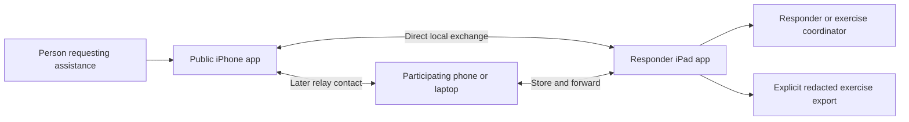

# System architecture

> Signed relay checkpoint (2026-10-08): [separate-process evidence](../experiments/rescue-demo/RELAY_NETWORK.md) verifies signed bounded routing, durable exact retries and delayed reverse receipts over sequential Mac loopback contacts. [Native relay controls](../experiments/rescue-demo/NATIVE_RELAY.md) are verified with controller/socket tests, a signed app build and an approved attended native simulator relay/restart walkthrough (2026-10-08/09). Physical/OS isolation and full-product gates remain open.

> Bounded portfolio checkpoint (2026-10-08): [secure exchange evidence](../experiments/rescue-demo/SECURE_EXCHANGE.md) now establishes manually paired signed/encrypted Apple endpoints with C++ durable state. Full-product enrollment, private storage and physical gates remain open; CryptoKit is an Apple adapter, not portable C++ cryptography.

> Current execution status (2026-10-08): see [current state / resume](CURRENT_STATE.md) and [portfolio tasks](TODO.md#current-portfolio-tasks). This document retains its product requirements, proposal or dated evidence; it does not claim that all described capabilities are implemented.

Status: proposed prototype architecture, v0.1 · 2026-10-07

## 1. Architecture in one sentence

Swift apps collect input and operate native Apple APIs; the same C++ engine on each endpoint owns durable messages, delivery state, synchronization, and later localization; optional relays move encrypted envelopes without needing a cloud server.

The first milestone is the [PRD](PRD.md) public-to-responder round trip. This document describes component ownership; [system design](SYSTEM_DESIGN.md) defines behavior and data contracts.

## 2. System context

The middle device is optional for M1 and tested explicitly in M2. There is no automatic route to a fire department, emergency call center, or internet recipient. An enrolled endpoint must become reachable within the deployment.

## 3. Components and ownership

| Component | Language / location | Responsibility | Must not own |
|---|---|---|---|
| Public UI | SwiftUI / iPhone | Compose SOS; manual location; consent; delivery and reply display | Routing decisions or optimistic rescue promises |
| Responder UI | SwiftUI / iPad | Request list/detail; acknowledge; reply; handling updates | Invented coordinates or implicit dispatch |
| Platform adapters | Swift / Apple clients | Radio APIs, location/motion, Keychain, lifecycle, permission reporting | Business state transitions independent of the engine |
| Engine | C++20 / all nodes | Ingest events; persist; reconcile; schedule; derive snapshots | Apple-only frameworks or hidden cloud calls |
| Store | Embedded local database | Transactional envelope/event storage; retry state; exercise lifecycle | New authoritative statuses |
| Security boundary | Reviewed native/library integration | Identity validation, role verification, endpoint encryption, protected keys | Homemade primitives or trust based on display names |
| Localization module | C++ / eligible endpoint, M3 | Baseline/fusion estimates and quality flags from normalized inputs | Treating reported floor as ground truth outside experiments |
| Replay/scenario runner | C++ / development laptop | Deterministic contacts, failures, metrics, recorded-event replay | Evidence of physical radio or sensor reliability by itself |
| Optional relay daemon | C++ / laptop, M2+ | Local transport adapter and durable opaque envelope queue | Access to private request bodies |

The two app interfaces may initially share a workspace/build configuration. Product roles remain separately authorized. A role toggle is not sufficient to grant responder authority.

## 4. Deployment choices

### M1: direct controlled drill

Two prepared physical Apple devices, one public iPhone and one responder iPad. Apps stay foreground. Internet is absent; no Wi-Fi access point is required in the intended baseline experiment. A Multipeer Connectivity adapter is provisional, subject to NET-01.

### M2: relay drill

Add a prepared relay node and alternate contact opportunities. Prove A-to-B then B-to-C with A-to-C unavailable. Test forwarding in the engine; do not call a group session multi-hop unless a real isolated intermediate path was measured. A laptop relay initially uses a separate local-LAN adapter; it does not automatically join Apple's proprietary transport. Physical interoperability is a separate acceptance check.

### Later pilot

Choose a validated device/OS/transport matrix. Hardware relays, BLE, Wi-Fi Aware, and optional internet gateways may extend coverage. These are alternatives to investigate rather than prerequisites added without evidence. Public distribution also needs trusted discovery and installation/readiness planning.

## 5. Transport strategy

| Candidate | Useful experiment | Constraint / gate |
|---|---|---|
| Multipeer Connectivity | Quick foreground Apple-device exchange | Background sessions disconnect; test reconnection [R03](RESEARCH.md#r03) |
| Core Bluetooth | Short payload/contact and lifecycle experiment | Advertising, discovery, and execution restrictions [R05](RESEARCH.md#r05) |
| Wi-Fi Aware | Paired compatible-device throughput/connectivity | OS/hardware support, pairing, runtime, cross-platform tests [R04](RESEARCH.md#r04) |
| Local LAN | Laptop runner or optional relay integration | Requires a reachable local network; isolate from internet |
| Dedicated radio/hardware | Later partner deployment | Requires hardware suitability, protocol integration, and coverage evidence |

Keep identity, message semantics, and routing above the adapter. Replacing a radio adapter must not change what "acknowledged" means. No API-level connectivity proves an application-level return path.

## 6. Engine boundary

Use a small C-compatible bridge with opaque engine handles and owned byte buffers/snapshot values. It lets Swift invoke C++ without exposing complex template or reference lifetimes. Direct C++ interoperability remains an alternative [R17](RESEARCH.md#r17).

| Input to engine | Output from engine |
|---|---|
| Local command: create request, append update, acknowledge, reply, close | Committed result or actionable validation/storage error |
| Verified inbound envelope and peer context | Receipt decision, deduplicated state changes, forwarding work |
| Peer connected/disconnected and send completion | Bounded transport sends and retry eligibility |
| Clock/lifecycle changes | Persisted recovery state and visible capability/freshness flags |
| Normalized sensor observation, M3 | Estimate with provenance, validity, and quality flags |

Serialize engine mutations on one executor per node. Swift adapters enqueue inputs and consume outputs; the UI observes immutable snapshots on the main actor. Do not block the main actor on networking, database work, or inference. Platform callbacks never retain borrowed C++ storage.

## 7. Data path

1. Validate a local user action and verify its role.
2. Commit the event and outgoing envelope atomically.
3. Publish a UI snapshot reflecting the durable state.
4. Discover/validate an enrolled peer through the adapter.
5. Exchange bounded inventories, then missing envelopes.
6. Recipient validates, commits, and returns a device receipt.
7. A human responder's acknowledgment is a separate authenticated event.
8. Replies and handling events use the same durable path in reverse.

Private content is transformed only at its endpoint. Transit relays do not estimate floors, translate requests, or merge their bodies.

## 8. Trust and observability

The coordinator provisions the exercise authority and membership. Public participants, responders, and relays have different permissions. Endpoint encryption, role certificates, and message integrity are specified in [security/privacy](SECURITY_PRIVACY.md); the exact reviewed cryptographic suite is gated before private-data implementation.

Capture local metrics for queue age/size, contact duration, retries, delivery facts, integrity failures, and lifecycle interruption. Default logs exclude message bodies and precise personal location. Explicit exercise export may include consented ground truth; it is a different artifact with restricted handling.

## 9. Build organization, when implementation begins

Expected logical areas: public/responder Swift clients; platform adapters; C++ engine and localization; C++ scenario tools; shared protocol fixtures; device test evidence. Do not create these directories during the documentation task.

Use CMake for standalone C++ builds and package an Apple-compatible library for the Swift clients. Exact compiler, Xcode, packaging, dependencies, and test commands must be recorded by ENG-01. No existing build commands are asserted here.

## 10. Alternatives rejected for the MVP

- Mandatory cloud backend: contradicts the prepared offline exchange.
- Browser-only public interface: not a demonstrated substitute for native radio/lifecycle access.
- Full mesh/BPv7 implementation before the direct workflow: adds protocol scope before user value is proven.
- An LLM in the authoritative location/status path: unnecessary for the first outcome and difficult to validate.
- Continuous responder tracking as the only initial interface: removes the agreed public SOS journey.
