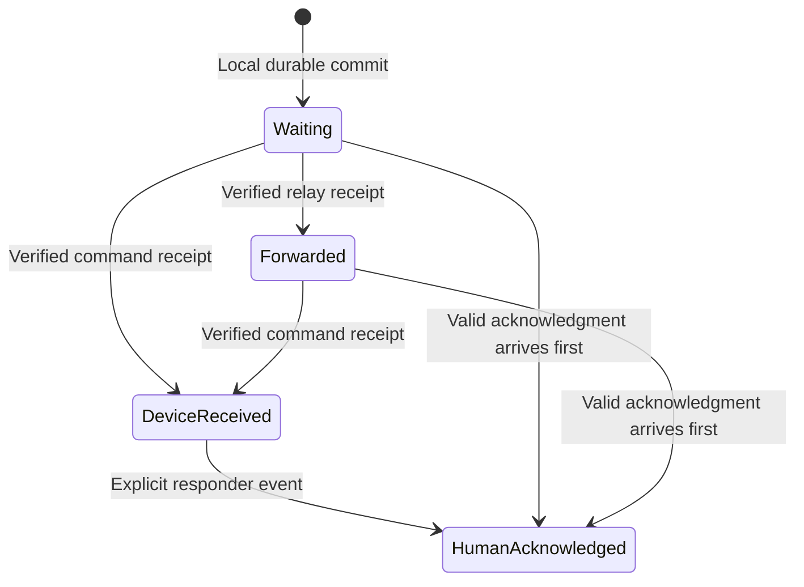

# System design

> Current execution status (2026-10-08): see [current state / resume](CURRENT_STATE.md) and [portfolio tasks](TODO.md#current-portfolio-tasks). This document retains its product requirements, proposal or dated evidence; it does not claim that all described capabilities are implemented.

Status: logical prototype design, v0.1 · 2026-10-07

This specifies state, data ownership, and failure behavior. Names are proposed contracts, not implemented APIs. Exact serialization and reviewed security encoding must be frozen in ENG-02 and SEC-01 before code; do not invent a wire protocol during unrelated implementation tasks.

## 1. Model

| Record | Minimum information | Owner |
|---|---|---|
| Exercise | ID, authority identity, authorized roles, start/end, protocol version | Coordinator |
| Identity | Incident-scoped key ID, role proof, public keys, optional display label | Enrolled device |
| AssistanceRequest | Request ID, creator ID, exercise ID | Public endpoint |
| RequestEvent | Event ID, request ID, author, author sequence/epoch, kind, original timestamp, encrypted body | Event author |
| LocationObservation | Observation ID, source, observed time, time quality, location fields, quality flags | Observing endpoint |
| Envelope | Message ID, destination key ID, exercise ID, version, authenticated binding, encrypted body | Source, then opaque copies |
| DeliveryFact | Referenced message ID, fact type, authorized issuer, issued time, integrity proof | Reporting endpoint |
| HandlingRecord | Request ID, command revision, status, responder-provided details | Single command authority in prototype |
| PeerContact | Peer ID/role, transport, capabilities, local connect/disconnect times | Local node |

IDs are opaque, collision-resistant, and independent of names/phone numbers. Protocol fixtures must test two requests with the same description and timestamp remaining distinct.

## 2. Location contract

Separate **reported** and **estimated** location. Neither silently overwrites the other.

| Field group | Meaning |
|---|---|
| Reported | Building/landmark, floor label, room/zone, user-provided correction time |
| Geographic | Latitude/longitude if available, horizontal accuracy metadata, source time |
| Relative vertical | Height change in meters relative to a named/reference observation |
| Estimated floor | Candidate labels/range only when a valid mapping exists |
| Provenance | User report, OS location, pressure baseline, sensor fusion, or known checkpoint |
| Validity | Available, unavailable, stale, conflicting, or time uncertain |
| Quality | Method/version, supporting conditions, confidence only when empirically calibrated |

Use SI units at the C++ boundary. Adapter code converts Apple pressure units explicitly. Keep relative height distinct from sea-level altitude, height above terrain, and labeled floor. A 3-meter rise does not by itself identify "floor 2."

No room coordinate is synthesized from a floor estimate. If only a building and reported floor exist, show text or an appropriate schematic rather than a fabricated precise map pin.

## 3. Message/event kinds

M1 supports request creation, request correction/follow-up, withdrawal request, endpoint device receipt, human acknowledgment, responder reply, assignment update, resolution, explicit reopen, and command-recorded withdrawal disposition. Endpoint receipts cover both the command receiving public messages and the requester receiving responder messages. Relay receipts and location updates join in M2/M3. An event references its original request and, where applicable, the exact message it acknowledges.

A device receipt follows durable commit. A human acknowledgment requires an explicit action by an authorized responder. A reply cannot establish authority merely by including a responder-sounding name.

Validate device receipts against the enrolled intended destination identity, exact message, and exercise. The public endpoint can attest receipt of a responder message addressed to it; that does not grant responder authority. Receipt messages do not themselves require delivery receipts, avoiding receipt loops. Responder-side projections distinguish locally recorded action from delivery to the requester. An operator display label is attributed to the verified command identity; it is not an individually verified credential.

## 4. State transitions

This is a display projection of accumulated delivery facts. Receiving stronger authenticated evidence before weaker evidence is valid. Duplicate facts do not regress the display. Queuing a new follow-up starts delivery tracking for that new message rather than pretending the original acknowledgment covered it.

Handling status is separate: **open → assigned → resolved**, with explicit command revisions. Resolution may follow open directly if the responder records a reason. Explicit reopening is **resolved → open**, with a new command revision and reason. Withdrawal is an independently delivered public event; command records and returns its disposition without automatically changing handling status. Never interpret transport expiration as request resolution. Late valid corrections/withdrawals are visible even after closure and can prompt an explicit reopen; they do not automatically rewrite responder disposition.

## 5. Ordering and concurrency

- Events are immutable. Reconciliation is set union by event ID followed by authorization/validity checks.
- Public events use a persisted author sequence within an author epoch. An epoch change is explicit; wall-clock time is not the sole ordering mechanism.
- Preserve the event stream for provenance; derive a request snapshot from accepted events.
- M1/M2 have a single command writer for handling revisions. No distributed multi-command consensus is implied.
- Missing predecessor events may be stored pending reconciliation; an authenticated acknowledgment can still establish its own delivery fact.
- Same-ID different-content collisions are rejected and recorded as integrity failures; do not select whichever arrived last.

## 6. Time and freshness

Record original observation time, receive time, and local monotonic time where available. A relay never substitutes its receive time for the original observation time.

During drills, the coordinator establishes and measures clock alignment. When that bound is available, display source observation age including uncertainty. Without a trustworthy bound, display **observation time uncertain** and separately **received on this device N seconds ago**. This is not a claim that the observation was made N seconds ago.

Detect wall-clock jumps and restarts; never let a negative calculated age make an observation fresh. Location freshness categories are an experimental UI policy, not safety thresholds. Initial display buckets: up to 30 seconds, 30–120 seconds, older than 120 seconds, or time unknown; always show the actual age/bound when known.

## 7. Persistence and transaction boundaries

Candidate storage is an embedded transactional database. Use separate logical collections/tables for exercises, identities, immutable events, encrypted envelopes, delivery facts, projections, outgoing work, and redacted diagnostics. Exact SQL is an implementation deliverable.

Local submission commits the event plus outgoing work before success is reported. Inbound handling commits validated content and deduplication state before sending a receipt. Store projection changes in the same transaction or rebuild deterministically from committed events.

On restart, recover pending work and state without creating new message IDs. Reset transport sessions, not request identity. If storage is unavailable/full, show an actionable failure; never display "waiting to send" for an uncommitted request. Keep private keys in platform-protected storage, not ordinary database rows.

## 8. Prototype resource policy

These are test defaults, to be tuned with evidence, not radio or safety guarantees.

| Setting | Initial default |
|---|---|
| Free-text description/reply | At most 2 KiB UTF-8; explain limits before send |
| Complete application envelope | At most 8 KiB after encoding; check before transmission |
| Pending relay storage | 1,000 envelopes or 10 MiB, whichever is reached first |
| Maximum forwarding depth | 4 application hops in M2 |
| Forwarding peers per message per node | At most 3 eligible distinct peers in M2 |
| Parallel sends per peer | 1 initial transfer |
| Retry after transient failure | Bounded exponential backoff, 1/2/4/8/16/30 seconds; reset on a new contact |
| End of exercise | Stop discovery/forwarding; explicit local record/export retention policy |

Queue counts exclude displayed historical records. Limit memory and frame assembly before allocating from untrusted input. Hop/forwarding limits bound cooperative nodes; they do not defeat malicious nodes or prove a global replica count. No automatic unresolved-request eviction is allowed. When capacity is exhausted, stop accepting new relay custody and report it; endpoints report local submission failure rather than silently drop.

No global message-expiry policy is imposed in M1/M2. Exercise closure stops forwarding. ENG-02 must specify a clock-safe expiry strategy before unattended deployments; stale observations stay visibly stale even while retained.

## 9. Contact exchange and M2 forwarding

1. Authenticate exercise/peer eligibility and learn the peer's role/capabilities.
2. Exchange bounded inventories of message IDs appropriate to that exercise; avoid publishing request bodies.
3. Request missing messages within queue and byte budgets.
4. Reassemble bounded frames if the adapter needs fragmentation; reject malformed/oversized content.
5. Validate integrity and destination handling; store opaque envelopes or commit endpoint events.
6. Return authenticated device-level receipts after durable acceptance.
7. Schedule missing acknowledgment/reply messages for subsequent contacts.

Prioritize a reachable destination over replication. For M2, reserve 75% of a contact's send-byte budget for control receipts and assistance events, and at least 25% for other eligible messages when present. Apply oldest-waiting order within a class. Receipts have a bounded size/count so they cannot monopolize the budget. Later scheduling compares alternatives rather than assuming these defaults are optimal.

New location samples may supersede older queued samples from the same source/session. Never coalesce away initial SOS, human acknowledgment, withdrawal, correction, or handling events. Preserve historical measurements separately for explicit exercise replay.

## 10. Logical interfaces

| Boundary | Commands / events | Contract |
|---|---|---|
| UI → engine | SubmitRequest, AppendPublicEvent, AcknowledgeRequest, Reply, SetHandlingStatus | Role-aware validation; durable success or explicit error |
| Engine → UI | RequestSnapshotChanged, MessageDeliveryChanged, CapabilityChanged | Immutable values; no optimistic delivery facts |
| Adapter → engine | PeerAvailable, PeerUnavailable, EnvelopeReceived, SendCompleted | Transport completion is not responder receipt |
| Engine → adapter | SendEnvelope, CancelTransfer, DiscoverWithinExercise | Bounded buffers; cancellation and ownership defined |
| Sensors → localization | Pressure/relative altitude, motion, OS location, reference event | Units, timestamps, missing data, and capability flags explicit |
| Engine → export | Consented exercise event stream and redacted metrics | Explicit action, role check, retention label |

All commands/events carry an exercise context and a correlation ID. Exact function signatures and serialization become versioned fixtures in ENG-02/ENG-03. Unsupported major versions fail visibly; unknown optional fields may be ignored only if integrity and required semantics remain valid.

## 11. Failure behavior

| Condition | Required behavior |
|---|---|
| No responder or no return path | Keep waiting; show absence of delivery/acknowledgment |
| Background/locked app | Report measured capability; recover pending work when runtime returns |
| Duplicate or out-of-order traffic | Idempotent reconciliation; preserve event provenance |
| Role spoofing / bad integrity | Reject trusted-state mutation; bounded diagnostics |
| Clock mismatch | Mark observation age uncertain; do not refresh stale information |
| Permission/sensor missing | Keep manual workflow usable |
| Relay capacity exhausted | Decline custody; sender retains responsibility |
| Known drill closure or validated planned end | Stop local networking; do not fabricate resolution; isolated peers may learn early closure later |

## 12. Future interfaces

An internet gateway, 911/CAD connector, multiple command authorities, public responder directory, and AI service each need a separate design. No REST endpoints or live emergency-center integration are claimed by this document. Later C++ services retain the same event and delivery semantics.
