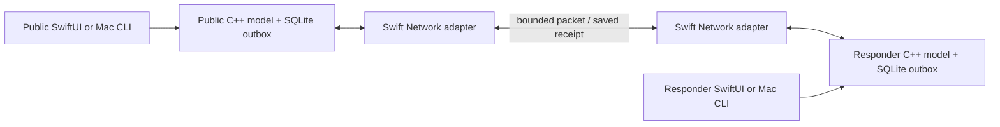

# Local rescue exchange — sample data only

Each app/CLI instance owns one C++ endpoint and one saved outbox. A public endpoint sends an SOS; a responder endpoint saves it and returns a device receipt. Human acknowledgment and replies are separate responder actions. No cloud service is required for this local socket exchange.

The protocol and SQLite files are plain and unauthenticated. Use only the preset samples. Bonjour names and fixture roles do not verify identity. Physical no-internet/no-common-access-point radio behavior is not established by simulator or loopback results.

## Native walkthrough

1. Run the app on two supported test instances, or one simulator with the Mac host below. Select **Local exchange**, then **Public endpoint** on one and **Responder endpoint** on the other.
2. Send the reviewed sample SOS. Before exchange its status stays waiting and the saved queue contains the original.
3. Start local exchange on both. Open Nearby sample peers and select the other endpoint's Transfer button. The receiver saves the SOS before the public endpoint shows device receipt.
4. On the responder, explicitly acknowledge and send a sample reply. Select the public peer to send the return queue. Later actions transfer automatically to that selected peer while active; a failed transfer clears selection and retains unconfirmed messages.
5. Stop or force-close with a queue pending. Relaunch restores local mode, role and saved history; networking stays stopped. Start and select the peer to retry. Lost receipts do not duplicate requests.
6. Exercise correction, assignment, resolution, withdrawal decision and explicit reopening. Delivery, human acknowledgment and handling remain distinct.
7. Reset **both** endpoints before starting another sample request. Fixed fixture IDs do not support independent epochs. Training mode retains its separate saved session.

Foreground operation only: entering background stops exchange and invalidates pending callbacks. Temporary inactive state does not stop the service, allowing a system permission prompt to be handled. Real-device permission denial and lifecycle behavior still need physical testing.

## Mac host

Build from the repository root:

```sh
swift build --package-path experiments/workflow-model \
  --scratch-path /private/tmp/rescue-exchange-swift --product rescue-exchange-host
```

In separate terminals (use unused ports and fresh absolute sample-store paths):

```sh
/private/tmp/rescue-exchange-swift/arm64-apple-macosx/debug/rescue-exchange-host \
  0 /private/tmp/sample-public.sqlite 18771
/private/tmp/rescue-exchange-swift/arm64-apple-macosx/debug/rescue-exchange-host \
  1 /private/tmp/sample-responder.sqlite 18772
```

The executable path above matches the verified Apple-silicon development host. `swift build --show-bin-path` with the same package/scratch arguments identifies the path on another supported Mac.

In the public terminal: `sos`, then `send 18772`. In the responder terminal: `ack`, `reply`, then `send 18771`. Inspect `state` on both. Public `correction` followed by `send 18772` updates the responder's reported location. `send` uses Mac loopback only; to reach a native simulator, use `peers` and `send-peer <exact Bonjour name>` instead. Native peer buttons select a discovered Mac host.

Other preset commands: `assign`, `resolve`, `withdrawal`, `disposition`, `reopen`, `reset` and `quit`. Only each role's valid actions are accepted. Kill/restart a host using the same role/path to verify queue recovery. `quit` stops its listener/browser. No personal free text is accepted by the walkthrough.

## Architecture and bounds



C++ validates the bounded ORX1 binary packet before mutation. Receiver history and deterministic receipt commit together; sender receipt and pending-original removal commit together. Failed saves send no successful receipt. Exact duplicate originals return the same saved receipt. Role-tagged v2 endpoint stores cannot open as the v1 training store or as the other role. Recovery checks acceptance-order history, canonical IDs, pending originals and ordering. Receiver receipts stay in history, not in its outgoing queue.

Per endpoint: 128 history events, 64 pending originals, 64-byte IDs, 2 KiB combined text/location. A history slot is reserved for each pending original's eventual receipt. New work rejects when reserve is exhausted; duplicates and already pending confirmations remain possible. There is no retention/compaction policy yet. TCP frame payload is 1–4096 bytes, buffered data at most 4100; eight concurrent sessions, eight-second absolute deadlines, at most 20 discovered peers. Each send drains at most 64 originals sequentially. There is no automatic retry/backoff, encryption, authenticated identity, relay, general dependency repair or multiple-request support.

## Verified checkpoint — 2026-10-08

- **30/30 CTest checks** passed in Debug with AddressSanitizer/UndefinedBehaviorSanitizer and Release. Six endpoint scenarios add independent exchange, dropped receipt/restart, locked commits, schema/role isolation, malformed packets and reserved-capacity checks to the original 24 domain/bridge/storage checks.
- **33/33 Swift tests** passed: original ten plus packet fragmentation/bounds, independent endpoint exchange/restart, real loopback sockets, malformed/truncated streams, handler failure, deadline/session limits, peer filtering and mode/callback recovery. A failed-peer regression was observed red before clearing peer selection, then green.
- Separate **Mac processes** exchanged SOS, explicit acknowledgment/reply and correction. Refused connection retained the original; process termination/restart recovered its outbox and subsequent delivery cleared it. Reproduce with:

```sh
python3 experiments/workflow-model/tests/process_exchange.py \
  /private/tmp/rescue-exchange-swift/arm64-apple-macosx/debug/rescue-exchange-host
```

- Native iPhone 17 Pro / iOS 26.4 simulator exchanged SOS with a Mac responder via Bonjour, displayed saved-device receipt and explicit acknowledgment/reply, and retained local role/history after restart without restarting networking.
- Native iPad Pro 11-inch (M5) / iOS 26.4 simulator received SOS from a Mac public endpoint. Force-quit before returning acknowledgment/reply retained two originals; relaunch/start/peer selection delivered both. Native assignment/resolution also reached the Mac public endpoint. Original training sessions remained separate. Rendered phone/tablet layouts were inspected.
- Simulator Debug build succeeded with Xcode 26.4 / Swift 6.3. Actual Claude Code implemented the scoped Swift adapter/tests and performed read-only C++ and whole-branch reviews. Final review found no blockers for the synthetic local demo; receipt reservation, canonical IDs, recovery ordering and callback/failed-peer issues were addressed and tested.

These are local development results, not physical radio, privacy-prompt, background delivery, range, power-loss, older-device, throughput or latency benchmarks. `includePeerToPeer` requests available peer-to-peer technologies; it does not establish a route or universal compatibility. Apple's local-network privacy simulator limitation makes physical permission tests necessary. NET-01, SEC-01, ENG-04 and M1 remain open.

[Design and primary sources](../../docs/superpowers/specs/2026-10-08-local-exchange.md) · [Plan and execution ledger](../../docs/superpowers/plans/2026-10-08-local-exchange.md).
