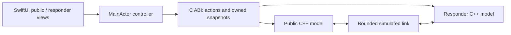

# Native rescue workflow demo

A runnable SwiftUI iPhone/iPad training app with **both public and responder views backed by the C++20 workflow engine**. One process owns two independent model instances; a bounded simulated link transfers events and receipts between them. No cloud or network connection is used by this app. This demonstrates real app behavior, **not physical offline networking**.

Only preset synthetic requests, locations and responses are exposed. State is in memory, one request per reset, lost when the app process exits. Role switching is a training control, not responder authentication. The separate [network probe](../network-probe/README.md) remains the transport experiment.

## Run in Xcode

Open `iOS/RescueDemo.xcodeproj`, select the `RescueDemo` scheme and an iPhone or iPad simulator, then Run. The local package dependency resolves to `../workflow-model`; no external packages are downloaded. Declared minimum iOS 18; actual UI verification below is on iPhone and iPad simulators running iOS 26.4. Physical installation/signing and older-device compatibility are unverified.

```sh
xcodebuild -project experiments/rescue-demo/iOS/RescueDemo.xcodeproj \
  -scheme RescueDemo -sdk iphonesimulator \
  -destination 'generic/platform=iOS Simulator' \
  -derivedDataPath /private/tmp/rescue-native-derived CODE_SIGNING_ALLOWED=NO build
swift test --package-path experiments/workflow-model \
  --scratch-path /private/tmp/rescue-native-swift
cmake -S experiments/workflow-model -B /private/tmp/rescue-native-cmake \
  -DCMAKE_BUILD_TYPE=Debug -DRESCUE_SANITIZERS=ON
cmake --build /private/tmp/rescue-native-cmake
ctest --test-dir /private/tmp/rescue-native-cmake --output-on-failure
```

## Walkthrough

1. In Public view, select a sample floor, review and send the sample SOS. The first status is device receipt, not human acknowledgment.
2. Switch to Responder view. Acknowledge the SOS and send a sample reply. Return to Public to see acknowledgment and the conversation.
3. Turn off Simulated connection. Send a location correction from Public and an acknowledgment/reply from Responder. Each side changes only from its own accepted events; the other side waits for delivery.
4. Reconnect. Queued events and receipts arrive; check the corrected location and per-message delivery states.
5. Assign, resolve, send a withdrawal, record its decision, then explicitly reopen. A late update prompts responder review without silently reopening a resolved request.
6. Reset clears both models and the transfer queue.

## Design



The bridge compiles the existing `workflow.cpp` through SwiftPM, also tested by CMake. JSON is an internal display snapshot, not the future network wire format. Swift owns and frees bridge snapshots and handles. Named Swift enums and C++ compile-time assertions pin the internal numeric schema. Each accepted action queues a transfer; destination receipt follows in-memory acceptance; acknowledgments remain explicit human actions. Stable receipt IDs avoid retry loops. Transfers survive a failed pump and remain unconfirmed until their return receipt arrives.

Limits: 128 events per model, 64 outstanding transfers, 256 pump steps per invocation, 64-byte references and model IDs, 2 KiB combined event text/location. Destination exhaustion preserves pending transfers and reports an error; reconnect cannot create storage space, so this sample requires reset. A receiver can have a message while its sender still awaits the receipt. That difference is expected asynchronous knowledge, not proof of lost data. Production requires durable outboxes, retention/reserved capacity and recovery.

## Evidence — 2026-10-07

- Simulator Debug build succeeded with Xcode 26.4 / Swift 6.3.
- 5 Swift integration tests passed: round trip, queued acknowledgment/correction, JSON escaping and repeated lifetime resets, late withdrawal/reopen, bounded-store partial delivery.
- 14 CTest checks passed with AddressSanitizer and UndefinedBehaviorSanitizer: 13 domain scenarios plus bridge boundary/queue/lifetime checks. Full-store integration verifies 64 follow-ups produce 62 confirmed deliveries, 2 unconfirmed transfers, and 63 receiver-local messages; no fabricated acknowledgment or receipt.
- Native UI inspected on iPhone 17 Pro / iOS 26.4 simulator: empty responder view; SOS review/send; device receipt; disconnected acknowledgment and correction; reconnect; acknowledgment/reply conversation; assignment/resolution; late withdrawal flag; explicit disposition/reopen. Final build rechecked for review/send, disconnected delivery, acknowledgment/reply, corrected-floor role switching, per-message states and reset.
- iPad Pro 11-inch (M5) / iOS 26.4 simulator: inspected both layouts, selected a sample floor, sent an SOS, acknowledged/replied and verified the public conversation. These are independent simulator sessions, not device-to-device networking.
- Read-only Claude Code review identified transfer exception safety, error lifetime, and numeric-state readability issues; these were addressed. A follow-up review found no blockers for this synthetic demo; duplicate SOS acknowledgment controls and input-limit documentation were also corrected. Store exhaustion and receiver/sender knowledge differences are documented prototype limits.

No physical radio, encrypted exchange, durable receipt, background operation, relay range, device-count throughput or delivery-latency benchmark is established here. This does not close NET-01, SEC-01 or M1. Next: durable storage/recovery, integrate the local transport behind a tested adapter, then physical measurements when devices are available.
