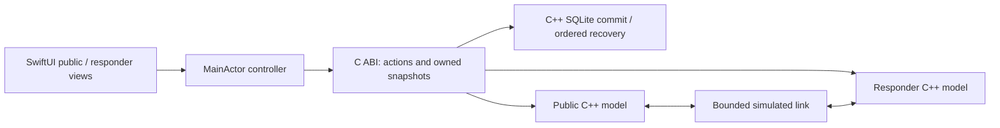

# Native rescue workflow demo

A runnable SwiftUI iPhone/iPad app with **public and responder views backed by the C++20 workflow engine**. Two modes are available:

- **Training mode:** one process owns two models and a simulated link, saved together in the original v1 SQLite session.
- **Secure exchange:** each app instance owns one role, one model and a separate v2 SQLite outbox. Real foreground Network-framework sockets carry signed/encrypted sample packets between checked opposite-role peers; Bonjour discovery names remain untrusted. Each receiver commits before returning a device receipt.

Only preset synthetic requests, locations and responses are exposed. One request per key epoch and coordinated reset/re-pair. Both modes preserve histories and pending originals across restart. Role selection is a sample control; checked public cards establish manual peer trust, not firefighter credentials. Storage remains unencrypted and physical offline radio behavior is unverified. Secure exchange now offers Direct and Via relay routes. [Native relay controls](NATIVE_RELAY.md) document manual upload/listening and the verification boundary. Follow the [secure exchange walkthrough and evidence](SECURE_EXCHANGE.md) for direct exchange; [plain local exchange](LOCAL_EXCHANGE.md) retains the earlier diagnostic baseline.

[Signed-relay measurements](RELAY_MEASUREMENTS.md) record 20/20 separate-process recovery scenarios and 60 original confirmations, distinct from native UI evidence and plain direct timings.

## Run in Xcode

Open `iOS/RescueDemo.xcodeproj`, select the `RescueDemo` scheme and an iPhone or iPad simulator, then Run. The local package dependency resolves to `../workflow-model`; no external packages are downloaded. Simulator signing is configured for Keychain; do not override CODE_SIGNING_ALLOWED to NO for secure-mode testing. Declared minimum iOS 18; actual UI verification below is on iPhone and iPad simulators running iOS 26.4. Physical installation/signing and older-device compatibility are unverified.

```sh
xcodebuild -project experiments/rescue-demo/iOS/RescueDemo.xcodeproj \
  -scheme RescueDemo -sdk iphonesimulator \
  -destination 'generic/platform=iOS Simulator' \
  -derivedDataPath /private/tmp/rescue-native-derived CODE_SIGNING_ALLOWED=YES build
swift test --package-path experiments/workflow-model \
  --scratch-path /private/tmp/rescue-native-swift
cmake -S experiments/workflow-model -B /private/tmp/rescue-native-cmake \
  -DCMAKE_BUILD_TYPE=Debug -DRESCUE_SANITIZERS=ON
cmake --build /private/tmp/rescue-native-cmake
ctest --test-dir /private/tmp/rescue-native-cmake --output-on-failure
```

## Training walkthrough

1. In Public view, select a sample floor, review and send the sample SOS. The first status is device receipt, not human acknowledgment.
2. Switch to Responder view. Acknowledge the SOS and send a sample reply. Return to Public to see acknowledgment and the conversation.
3. Turn off Simulated connection. Send a location correction from Public and an acknowledgment/reply from Responder. Each side changes only from its own accepted events; the other side waits for delivery.
4. Reconnect. Queued events and receipts arrive; check the corrected location and per-message delivery states.
5. Assign, resolve, send a withdrawal, record its decision, then explicitly reopen. A late update prompts responder review without silently reopening a resolved request.
6. Force-close and reopen while disconnected: the pending request or return messages remain queued. Reopening does not deliver them; reconnect explicitly.
7. Reset clears both models and the transfer queue transactionally and stays empty after restart. A save error retains the previous state; Reopen saved session reloads it. Retry queued transfers is available when connected with remaining transfers.

## Design



The bridge compiles the existing `workflow.cpp` through SwiftPM, also tested by CMake. JSON is an internal display snapshot, not the future network wire format. Swift owns and frees bridge snapshots and handles. Named Swift enums and C++ compile-time assertions pin the internal numeric schema. Each accepted action queues a transfer; the copied session is committed to SQLite before its actions or simulated receipts become visible; acknowledgments remain explicit human actions. Stable receipt IDs avoid retry loops. Transfers survive a failed pump and remain unconfirmed until their return receipt arrives.

Limits: 128 events per model, 64 outstanding transfers, 256 pump steps per invocation, 64-byte references and model IDs, 2 KiB combined event text/location. Destination exhaustion preserves pending transfers and reports an error; reconnect cannot create storage space, so this sample requires reset. A receiver can have a message while its sender still awaits the receipt. That difference is expected asynchronous knowledge, not proof of lost data. Local exchange uses separate endpoint transactions and reserved receipt capacity as documented in its walkthrough. Production still requires retention and security.

## Native baseline evidence — 2026-10-07

- Simulator Debug build succeeded with Xcode 26.4 / Swift 6.3.
- 5 Swift integration tests passed: round trip, queued acknowledgment/correction, JSON escaping and repeated lifetime resets, late withdrawal/reopen, bounded-store partial delivery.
- 14 CTest checks passed with AddressSanitizer and UndefinedBehaviorSanitizer: 13 domain scenarios plus bridge boundary/queue/lifetime checks. Full-store integration verifies 64 follow-ups produce 62 confirmed deliveries, 2 unconfirmed transfers, and 63 receiver-local messages; no fabricated acknowledgment or receipt.
- Native UI inspected on iPhone 17 Pro / iOS 26.4 simulator: empty responder view; SOS review/send; device receipt; disconnected acknowledgment and correction; reconnect; acknowledgment/reply conversation; assignment/resolution; late withdrawal flag; explicit disposition/reopen. Final build rechecked for review/send, disconnected delivery, acknowledgment/reply, corrected-floor role switching, per-message states and reset.
- iPad Pro 11-inch (M5) / iOS 26.4 simulator: inspected both layouts, selected a sample floor, sent an SOS, acknowledged/replied and verified the public conversation. These are independent simulator sessions, not device-to-device networking.
- Read-only Claude Code review identified transfer exception safety, error lifetime, and numeric-state readability issues; these were addressed. A follow-up review found no blockers for this synthetic demo; duplicate SOS acknowledgment controls and input-limit documentation were also corrected. Store exhaustion and receiver/sender knowledge differences are documented prototype limits.

## Saved-session checkpoint — 2026-10-07

- **24/24 CTest checks passed** in Release and Debug with AddressSanitizer/UndefinedBehaviorSanitizer: the previous 14 plus 10 recovery scenarios (restart, rejected schema/save/reset, writer lock, stale instance, corrupt/unsupported storage, interrupted transaction, full store, COMMIT lock, interrupted first initialization and WAL rejection).
- **10/10 Swift integration tests passed**: the previous 5 plus saved offline/return queue, handling replay/reset, corrupt startup preservation, non-file URL rejection and in-memory retry preservation.
- Latest simulator Debug build succeeded. On iPad, force-close/relaunch preserved an offline SOS, disconnected acknowledgment/reply and a corrected public location while the responder still held the older location. Reconnect delivered the queue and explicit acknowledgment. Reset stayed empty after relaunch in both roles.
- A backed-up synthetic simulator DB was temporarily assigned unsupported version 99. The app showed an unavailable-session/retry view, disabled connection actions and preserved the file through retry; restoring the backup recovered the earlier conversation. On iPhone, force-close/relaunch preserved an offline SOS with one pending transfer and an empty responder inbox. Rendered iPhone/iPad layouts were inspected. Independent simulators did not communicate.
- Actual read-only Claude Code review found initialization, schema validation and retry/recovery issues. These were fixed and retested; final follow-up found no blockers for the bounded single-process sample demo.

The store uses system SQLite, DELETE rollback journaling, synchronous EXTRA and fullfsync where supported. One transaction commits the bounded staged session before publishing it; load validates schema, counts, fields, acceptance-order replay and outbox consistency. Generation checks reject stale writers. Valid SQLite WAL headers are rejected before opening, preserving the tested main file and sidecars byte for byte. Bounds: main file 4 MiB, each recovery sidecar 8 MiB, 250 ms lock timeout. A hot rollback journal may change files during legitimate SQLite recovery; this is not a general tamper-proof file preservation mechanism. Arbitrary file replacement/races, invalid UTF-8 corruption and hardware power loss are not established recovery guarantees. Storage is unencrypted and reset is not secure deletion. Preset sample data only.

Commands above reproduce the tests; configure a separate CMake directory with `-DCMAKE_BUILD_TYPE=Release` for Release checks. [Storage spec and primary sources](../../docs/superpowers/specs/2026-10-07-durable-demo-session.md) · [Implementation plan](../../docs/superpowers/plans/2026-10-07-durable-demo-session.md).

This saved-training checkpoint established no physical radio, encrypted exchange, background operation or relay range. Later secure exchange and plain-loopback measurements are linked separately above. Saved simulated receipts are local training-session facts, not physical delivery evidence. This does not close NET-01, SEC-01, ENG-04 or M1. Local exchange now establishes separate endpoint ownership and real socket delivery with sample data. Next: physical measurements when devices are available and security before private data.

## Secure exchange checkpoint — 2026-10-08

See [secure walkthrough](SECURE_EXCHANGE.md) for current native pairing, encryption, exact checks and limits.62 Swift checks retain the original 33; C++30/Python14 remain green. Use real measured figures only for their stated baseline; secure latency is unmeasured.

[Controlled native relay hosting](PHONE_RELAY.md) is available from Setup: checked public cards, durable opaque custody and manual foreground forwarding. Native simulator/Mac evidence includes restart recovery and background stop; physical range and arbitrary mesh remain unverified.

[Automatic floor research](FLOOR_RESEARCH.md) is available from Setup for both audiences: optional Apple floor and a C++ relative-altitude feasibility baseline with stable starting reference. Separate labelled fixtures verify logic; physical floor accuracy and UW Wi-Fi positioning remain unverified. Research estimates never replace reported floor or enter SOS automatically.
